# Ehsan M

### Principal / Senior Software Engineer — .NET specialist, backend-leaning full-stack

~10 years designing and leading the development of scalable, message-driven backend
systems on the Microsoft stack. I build ASP.NET Core APIs and distributed services, and
I've shipped production platforms across **healthcare (EMR), association management,
e-commerce, and enterprise ERP** for US and international clients.

I care about clean architecture, testable code, and systems that stay reliable under
load — and I enjoy mentoring engineers and owning delivery end to end.

🔭 **Open to Senior .NET Engineer / Engineering Lead roles** (remote or relocation).

---

### 🛠️ Tech Stack

**Languages & Backend**

**Architecture**
`Microservices` · `Event-driven / message-based` · `REST APIs` · `Clean Architecture` · `CQRS` · `DDD patterns`

**Frontend**

**Data**

**Cloud & DevOps**

> Azure Service Bus · Key Vault · Redis Cache · Application Insights · App Service — AWS Certified Cloud Practitioner

---

### 💼 Selected Work & Experience

Client code is private — links point to the live products where they're public.
Full history on [LinkedIn](https://www.linkedin.com/in/iamehsaan/).

**Principal Software Engineer** · Allshore Talent / DatumSquare — *2019–present*
Backend lead on **MyNatca**, a platform for a 15k+ member US professional association — ASP.NET Core REST APIs, role-based access control, React/Redux front end, Mailgun email workflows, and scheduled background jobs on Azure.

**Senior Software Engineer** · Eworx International — *2018–2019*
Contributed to a healthcare enrollment platform integrating with CMS FFE APIs — ASP.NET Core, Angular + SurveyJS dynamic forms, and SQL Server stored-procedure optimization.

**.NET Web Developer** · Generix Solutions — *2017–2018*
Delivered modules for a manufacturing **ERP** (inventory, procurement, finance) — ASP.NET MVC, Entity Framework, Oracle PL/SQL, jqGrid/DataTables.

**Software Engineer** · Bilytica — *2016–2017*
Built modules for **[Cloudpital](https://www.cloudpital.com)**, an EMR & practice-management system — ASP.NET MVC / Web API, Knockout.js, SQL Server, LINQ reporting.

---

### 📸 Featured Projects

Production systems I've contributed to. The source is client-owned and private, so these
are UI walk-throughs from **vendor demo environments** — patient, staff, and client
identifiers are redacted.

#### 🏥 Cloudpital — EMR & Practice-Management System
**Software Engineer · Bilytica · 2016–2017**

Cloud-based EMR for clinics: a one-page patient medical summary, appointment scheduling,
e-prescribing, billing, and pharmacy/inventory management.
**Tech:** `ASP.NET MVC 5` · `Web API` · `C#` · `Knockout.js` · `SQL Server` · `LINQ`

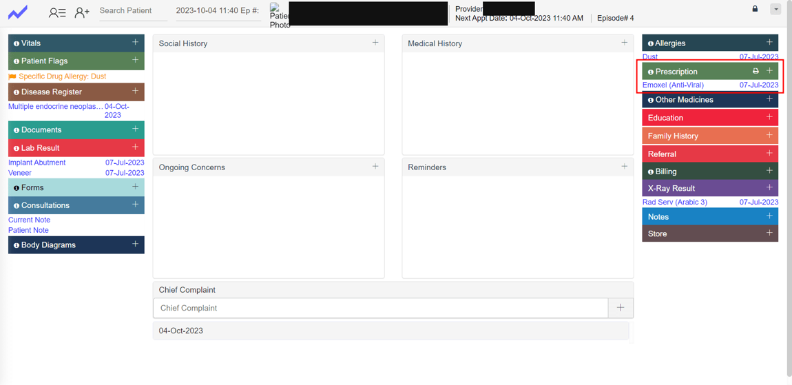

▸ More screenshots

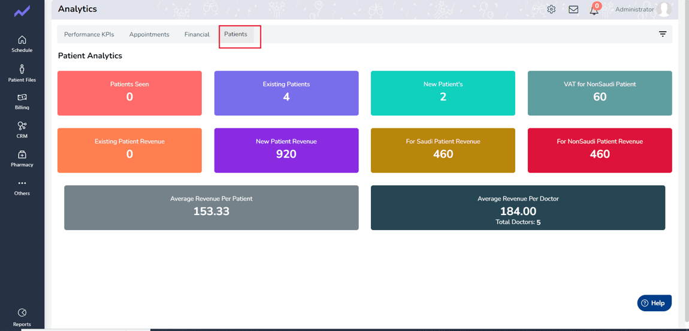

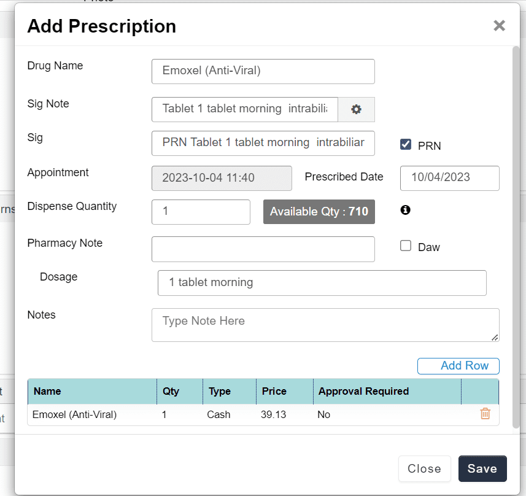

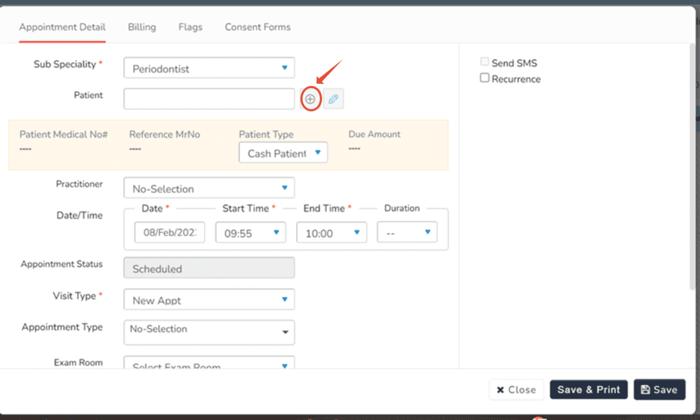

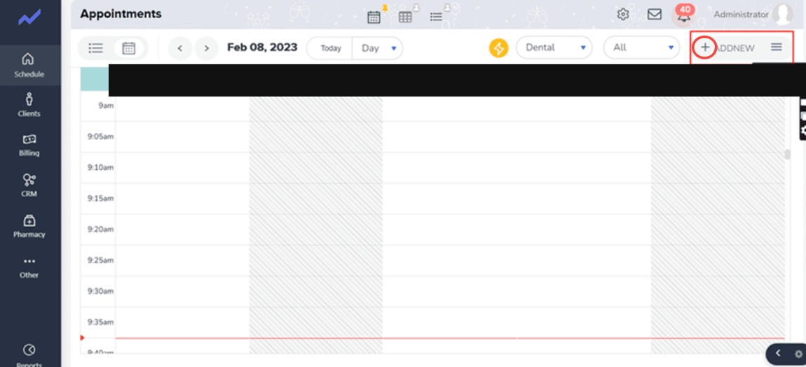

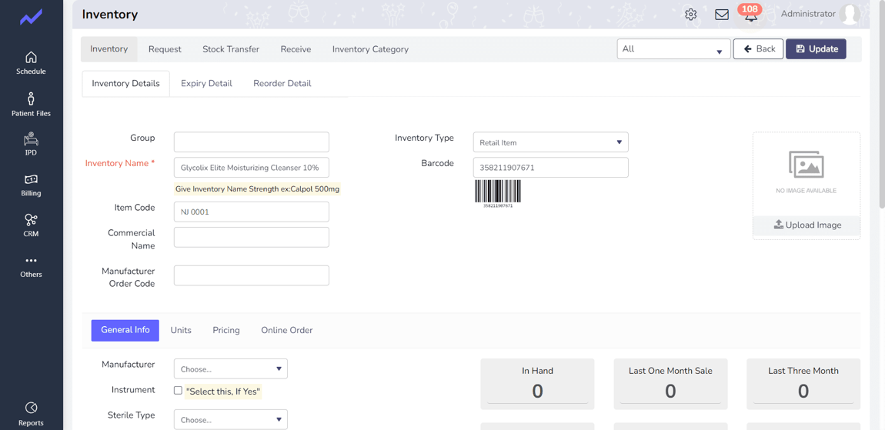

#### 🏭 Smart ERP — Manufacturing ERP
**.NET Web Developer · Generix Solutions · 2017–2018**

Unified ERP consolidating **inventory, procurement, and finance** for a manufacturing
client — automated approval workflows, gate-pass / goods-receipt, and a configurable item master.
**Tech:** `ASP.NET MVC` · `C#` · `Entity Framework` · `Oracle PL/SQL` · `Web API` · `jqGrid / DataTables`

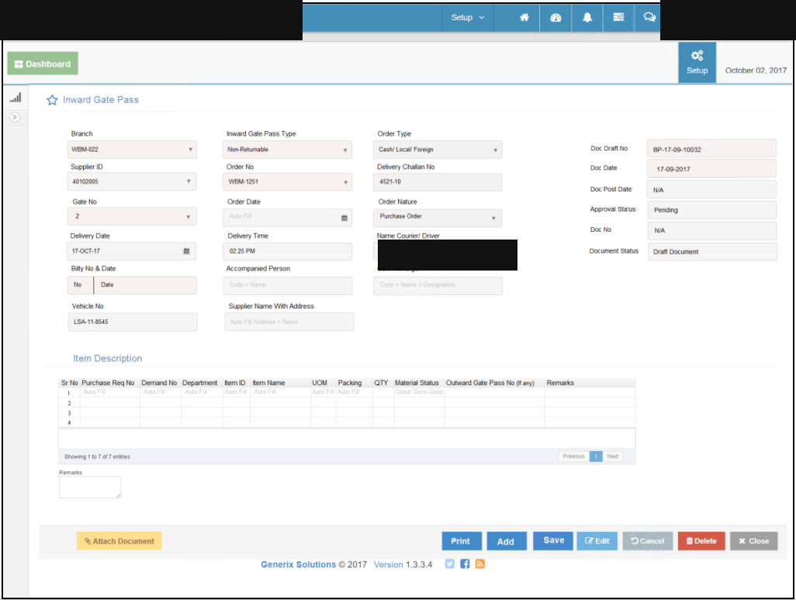

▸ More screenshots

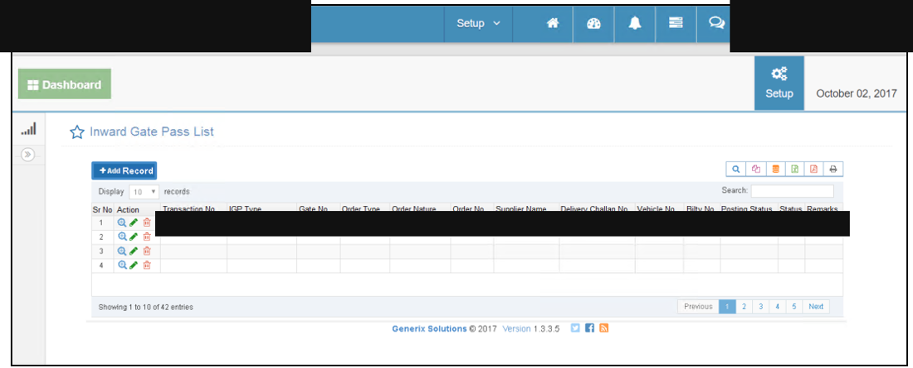

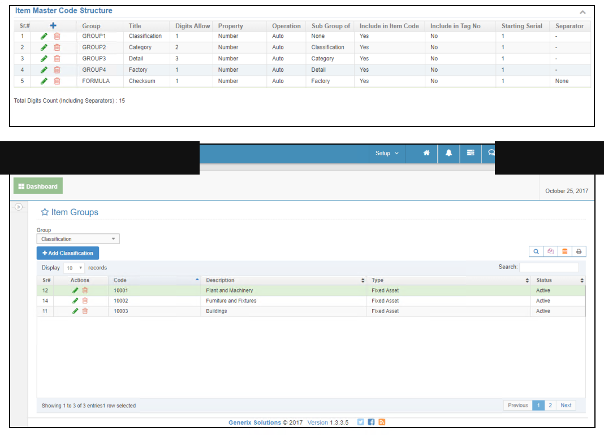

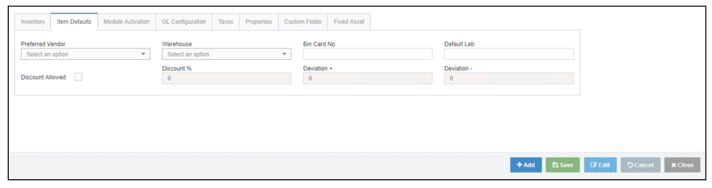

#### 🚗 ProDealership — Pre-owned Vehicle Marketplace
**Full-Stack Developer · Datumsquare · 2020–2021**

Vehicle sales platform with make / model / price search, image galleries, an inquiry
workflow, and an admin inventory manager.
**Tech:** `ASP.NET MVC` · `Angular` · `TypeScript` · `C#` · `Entity Framework` · `SQL Server`

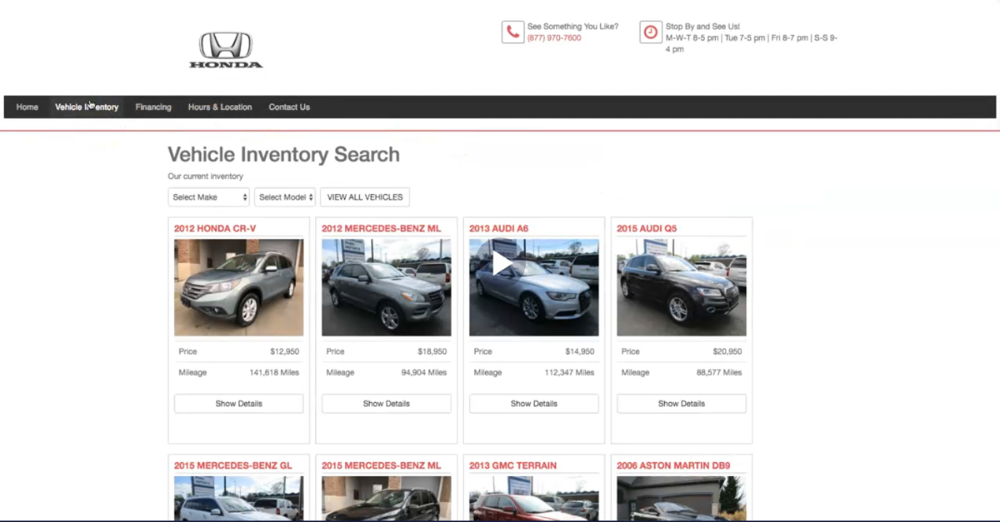

▸ More screenshots

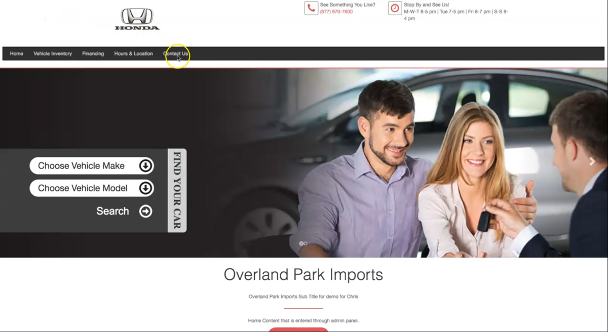

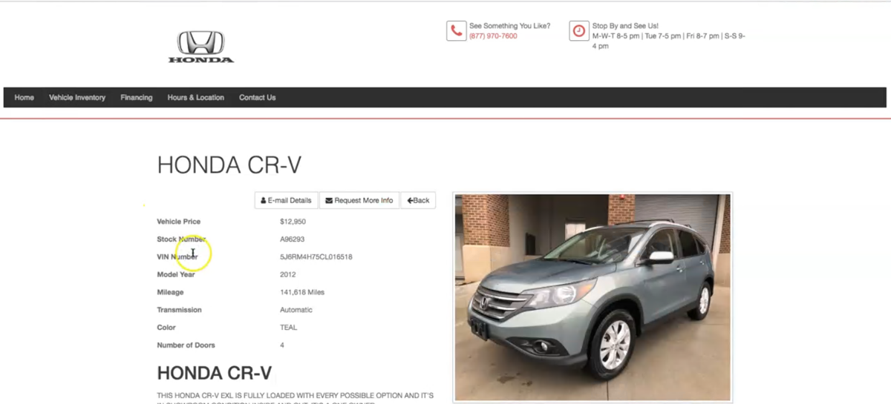

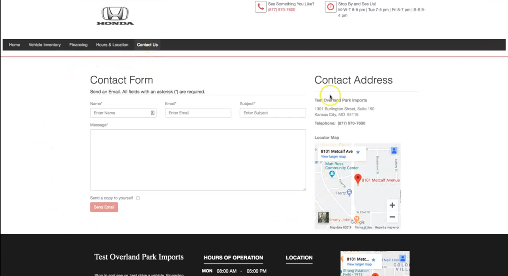

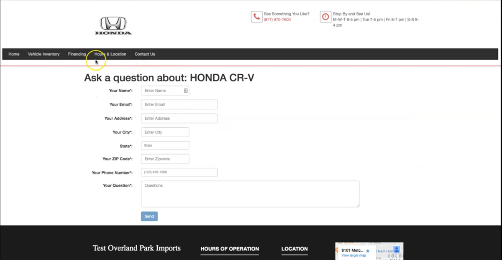

---

### 📫 Reach me

📍 Lahore, Pakistan · open to relocation
